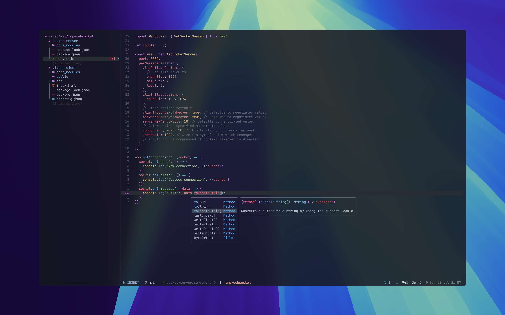

> NOTE: This dotfiles repo is managed by [GNU stow](https://www.gnu.org/software/stow/).

# Showcase




- Terminal Emulator - [WezTerm](https://wezfurlong.org/wezterm/index.html)
- Terminal Multiplexer - [Tmux](https://github.com/tmux/tmux)
- Shell - [Zsh](https://www.zsh.org)
  - [Syntax highlighting plugin](https://github.com/zsh-users/zsh-syntax-highlighting)
  - [Autosuggestion plugin](https://github.com/zsh-users/zsh-autosuggestions)
  - [Vi mode plugin](https://github.com/jeffreytse/zsh-vi-mode)
- Shell Prompt - [Starship](https://github.com/starship/starship)
- Command-line System Info - [Fastfetch](https://github.com/fastfetch-cli/fastfetch)
- Text Editor - [Neovim](https://neovim.io)

# Installation

1. Install [GNU stow](https://www.gnu.org/software/stow/)

```bash
# MacOS (using homebrew package manager)
brew install stow
```

2. Clone this repo into your home directory

> Backup your `dotfiles` folder first if you have one. (`mv ~/dotfiles ~/dotfiles.bk`)

```bash
git clone https://github.com/Al3bad/dotfiles.git
```

3. Backup any config files that might be overwritten by `stow`.

4. Navigate to the cloned repo

```bash
cd dotfiles
```

5. Put config files into your system using `stow`.

```bash
stow wezterm tmux zsh fastfetch neovim
```
